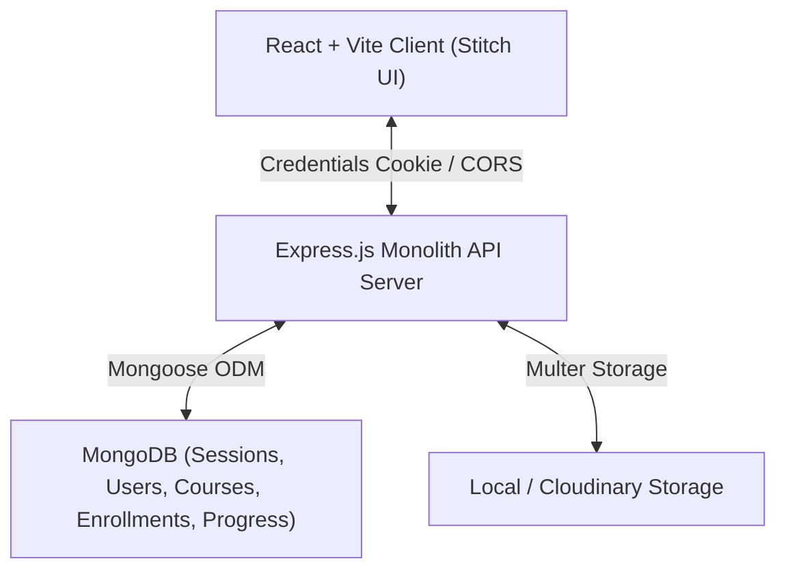
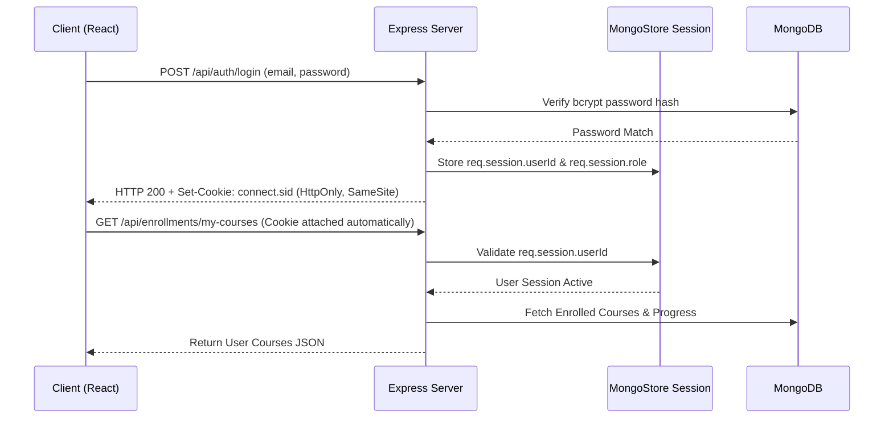

# SkillForge – Online Course-Selling Platform

SkillForge is a full-stack, production-ready, interview-defendable online course-selling platform built using the MERN stack (MongoDB, Express.js, React, Node.js) with extended session-based authentication, role-based access control (Student, Instructor, Admin), interactive course learning interface, progress tracking, instructor course builder, admin analytics, and modern Google Stitch UI design.

Designed specifically to empower B.Tech Computer Science students to demonstrate, explain, and defend end-to-end full-stack engineering concepts in placement technical interviews.

---

## 1. System Architecture & Diagram

### Architecture Diagram (Mermaid)



### Authentication Lifecycle (Session-Based Auth)



---

## 2. Technology Stack

- **Frontend**: React 18, Vite, TypeScript, Tailwind CSS, Axios, React Router DOM v6, Lucide React icons, Material Symbols.
- **Backend**: Node.js, Express.js, Mongoose ODM, MongoDB, `express-session`, `connect-mongo`, `bcryptjs`, Multer, Helmet, CORS.
- **DevOps & Infrastructure**: Docker, Docker Compose, Nginx.

---

## 3. Core Features

### Student Functionality
- Register and log in.
- Search and filter courses by category, level, duration, and price.
- View detailed course landing pages and curriculum sections.
- Demo payment checkout flow & course enrollment.
- View enrolled courses and resume learning on the **Student Dashboard**.
- Interactive Video Player with real-time lesson progress tracking and completion toggles.

### Instructor Functionality
- Register as Instructor or switch roles.
- Create and publish new courses with section & lesson builder.
- Upload course thumbnails and lesson streaming URLs.
- View total enrolled student metrics and earned revenue.
- Delete and edit owned courses.

### Admin Functionality
- View platform-wide statistics (total revenue, active users, course counts).
- User management table: change user roles (`student`, `instructor`, `admin`) and delete accounts.
- Course moderation table: view all draft and published courses.

---

## 4. Deep-Dive: Session-Based Auth vs. JWT (Interview Explanation)

### Why Session-Based Auth for SkillForge?
In the original 100xDevs Cohort backend reference, JWT (JSON Web Tokens) were used in request headers (`Authorization: Bearer <token>`). In this extended version, we implemented **Session-Based Authentication** using `express-session` and `connect-mongo`:

| Feature | Session-Based Authentication (SkillForge) | JWT (Stateless) |
| :--- | :--- | :--- |
| **Storage** | Stored server-side in MongoDB (`sessions` collection). | Stored client-side (localStorage/sessionStorage). |
| **Client Token** | Opague `connect.sid` cookie marked `HttpOnly`. | Signed JWT string containing payload claims. |
| **XSS Security** | **High** (`HttpOnly` prevents JS reading cookie). | **Vulnerable** if stored in `localStorage`. |
| **Revocation** | **Instant** (Server deletes session document in DB). | Hard until token expires or blacklist added. |
| **Statefulness** | Stateful (requires MongoDB session lookup). | Stateless (Server validates signature without DB hit). |

---

## 5. API Endpoint Reference

### Auth Endpoints (`/api/auth`)
- `POST /api/auth/register` - Register user (`name`, `email`, `password`, `role`).
- `POST /api/auth/login` - Authenticate user & set session cookie.
- `POST /api/auth/logout` - Destroy session & clear cookie.
- `GET /api/auth/me` - Fetch authenticated user session info.
- `PUT /api/auth/profile` - Update user name and avatar.

### Course Endpoints (`/api/courses`)
- `GET /api/courses` - Fetch public courses with filtering (`category`, `level`, `price`, `search`, `sort`).
- `GET /api/courses/:id` - Get course detail, curriculum sections, and enrollment status.
- `POST /api/courses` - Create new course (Instructor/Admin required).
- `PUT /api/courses/:id` - Edit course (Owner Instructor/Admin required).
- `DELETE /api/courses/:id` - Delete course (Owner Instructor/Admin required).

### Enrollment Endpoints (`/api/enrollments`)
- `POST /api/enrollments` - Enroll in course / process demo payment checkout.
- `GET /api/enrollments/my-courses` - Get student's enrolled courses with progress.

### Student Endpoints (`/api/student`)
- `GET /api/student/dashboard` - Get student learning statistics.
- `GET /api/student/progress/:courseId` - Get lesson progress for a course.
- `POST /api/student/progress` - Toggle lesson completed status.

### Instructor Endpoints (`/api/instructor`)
- `GET /api/instructor/dashboard` - Instructor revenue & enrollment stats.
- `GET /api/instructor/courses` - Get courses created by logged-in instructor.

### Admin Endpoints (`/api/admin`)
- `GET /api/admin/dashboard` - Platform-wide analytics.
- `GET /api/admin/users` - Get list of all registered users.
- `GET /api/admin/courses` - Get all courses for moderation.
- `PUT /api/admin/users/:id/role` - Change user role.
- `DELETE /api/admin/users/:id` - Delete user account.

---

## 6. Project Folder Structure

```
skillforge/
├── client/                      # React 18 + Vite + TypeScript Frontend
│   ├── src/
│   │   ├── components/          # Navbar, Footer, CourseCard, MicroPixelsCanvas, ProtectedRoute
│   │   ├── context/             # AuthContext (Session state)
│   │   ├── pages/               # Marketplace, CourseDetail, Login, Register, Dashboards, LearningPlayer
│   │   ├── services/            # Axios API client with credentials
│   │   ├── types/               # TypeScript interfaces
│   │   ├── App.tsx
│   │   └── main.tsx
│   ├── index.html
│   ├── tailwind.config.js
│   └── package.json
│
├── server/                      # Node.js + Express Backend
│   ├── src/
│   │   ├── config/              # db.js (Mongoose connection)
│   │   ├── models/              # User, Course, Enrollment, Progress schemas
│   │   ├── controllers/         # Auth, Course, Enrollment, Student, Instructor, Admin controllers
│   │   ├── middleware/          # authMiddleware, roleMiddleware
│   │   ├── routes/              # Auth, Course, Enrollment, Student, Instructor, Admin routes
│   │   ├── utils/               # seedData.js
│   │   └── index.js             # Main server entry point
│   ├── uploads/                 # Local media upload storage
│   └── package.json
│
├── docker-compose.yml
├── README.md
└── package.json
```

---

## 7. How to Run Locally

### Prerequisites
- Node.js v18+ & npm
- Local MongoDB running on port 27017 or MongoDB Atlas URI

### 1. Install Dependencies
```bash
npm run install:all
```

### 2. Configure Environment Variables
Copy `.env.example` in `server/` to `.env`:
```env
PORT=5000
MONGODB_URI=mongodb://127.0.0.1:27017/skillforge
SESSION_SECRET=skillforge_super_secret_session_key_2026
CLIENT_URL=http://localhost:5173
NODE_ENV=development
```

### 3. Seed Demo Data
```bash
npm run seed
```
**Demo Credentials created:**
- **Student**: `student@skillforge.com` / `password123`
- **Instructor**: `instructor@skillforge.com` / `password123`
- **Admin**: `admin@skillforge.com` / `password123`

### 4. Start Server & Client
In terminal 1 (Backend):
```bash
npm run dev:server
```
In terminal 2 (Frontend):
```bash
npm run dev:client
```
Access client app at `http://localhost:5173`.

---

## 8. Docker Instructions

Run full stack with local MongoDB via Docker Compose:
```bash
docker-compose up --build
```
Access the application at `http://localhost`.

---

## 9. Technical Interview Q&A Defense Guide

1. **Q: How does user authorization work on protected routes?**
   - **A**: The `requireAuth` middleware checks `req.session.userId`. If valid, it fetches the user document and attaches it to `req.user`. Then `requireRole('instructor')` checks if `req.user.role` matches allowed roles before delegating to controller logic.

2. **Q: How are session cookies handled across separate domains in production?**
   - **A**: In production, Express session cookies are configured with `httpOnly: true`, `secure: true`, and `sameSite: 'none'`, and Axios calls set `withCredentials: true` to ensure credentials header propagates automatically.

3. **Q: How is lesson completion calculated?**
   - **A**: Course progress total lesson count is computed dynamically from sections and lessons array lengths. The completed lesson ID set length divided by total lesson count calculates `completionPercentage` stored in MongoDB.
